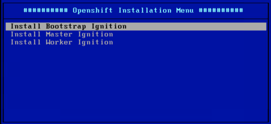

# Openshift Container Platform V4.3 Installation on bare metal with PXE
## Table of Content
- [Cluster Information](#Cluster-Information)
- [Retrieve Red Hat registered account for your clients with Cloud Paks entitlement](#Retrieve-Red-Hat-registered-account-for-your-clients-with-Cloud-Paks-entitlement)
- [Prepare the necessary infrastructure](#Prepare-the-necessary-infrastructure)
- [Prepare the installer virtual machine](#Prepare-the-installer-virtual-machine)
- [Prepare cluster ignition files](#Prepare-cluster-ignition-files)
- [Create the cluster VMs](#Create-the-cluster-VMs)
- [Install and configure dnsmasq to provide DHCP DNS PXE services](#Install-and-configure-dnsmasq-to-provide)
- [Prepare loadbalancing server](#Prepare-loadbalancing-server)
- [Start bootstrap process](#Start-bootstrap-process)
- [Post installation configuration](#Post-installation-configuration)
- [Configure cluster authentication](#Configure-cluster-authentication)
- [Complete and verify cluster installation](#Complete-and-verify-cluster-installation)
- [Configuring Rook Ceph storage](#Configuring-Rook-Ceph-storage)
- [Install Local image registry](#Install-Local-image-registry)
- [References](#References)

## Cluster Information:
* Control-plane vip: 169.60.247.110
* Compute/apps vip: 169.60.247.104
* Installer VM: 169.60.247.105
* Bootstrap VM: 169.60.247.106
* Master nodes: 169.60.247.107/108/109

##
## Prepare the necessary infrastructure:
1. Build a VMware Vsphere environment using your prefered way. We used in this guide 2 bare-metal ESXi servers and one Vcenter virtual server provisioned on IBM Cloud backed with iSCSI block storage. 
2. Provision a new RHEL 8 virtual machine on vcenter with hostname "installer.ocp.ibm.local" and assign it 2cores/16GB-Memory/50GB-disk. This machine will be used as a client to control the openshift installation, it will also host the following components:
* DNS/DHCP server (dnsmasq)
* Load-balancer (haproxy)
* PXE for booting the CoreOS nodes from the network
## Retrieve Red Hat registered account for your clients with Cloud Paks entitlement
* The process is explained [here](./retrieve-ocp-subscription.md).
## Prepare the installer virtual machine:
1. login into "installer.ocp.ibm.local" with root privileges.
2. Set the installer server hostname:
```shell
hostnamectl set-hostname installer.ocp.ibm.local
```
3. Disable selinux
```shell
sed -i 's/SELINUX=enforcing/SELINUX=disabled/' /etc/selinux/config
systemctl reboot
```
4. Configure Redhat subscription of the added server:
```shell
subscription-manager register --username='alaa-farrag-ibm' --password='xxxx'
```
5. Enable "Red Hat Developer Subscription":
```shell
subscription-manager list --available
subscription-manager attach --pool=8a85f99c6defdbe7016e022c8ecf7dde
```
6. Install httpd server:
```shell
yum install -y httpd
```
7. create a new directory to host the cluster installation artifacts:
```shell
mkdir -p /opt/ocp
```
8. Expose the created folder through httpd server:
```shell
ln -s /opt/ocp /var/www/html/ocp-www
```
9. Since the installer VM is hosting the haproxy loadbalancer, the control plane VIP (169.60.247.110) and apps VIP (169.60.247.104) need to be assigned as secandry IPs to interface ens192.
10. Update the httpd server to only listen on the installerIP address 169.60.247.105 (not the LA IP address) by applying the following configuration:
```
use the "Listen" config to assign specific IP address in "/etc/httpd/conf/httpd.conf" config file
Listen 169.60.247.105:8080

use the "Listen" config to assign specific IP address in "/etc/httpd/conf.d/ssl.conf" config file (if the file exists)
Listen 169.60.247.105:443 https
11. Start and enable httpd service:
```shell
systemctl enable --now httpd
```
12. Add firewalld rules to allow HTTP communication:
```
{
firewall-cmd --zone=internal --add-port=8080/tcp --permanent
firewall-cmd --reload
}
```
13. Disable selinux/firewalld
```shell
systemctl disable --now firewalld
```
14. download openshift client and installer for linux (can be downloaded from https://cloud.redhat.com/openshift/):
```shell
wget https://mirror.openshift.com/pub/openshift-v4/clients/ocp/4.3.12/openshift-install-linux-4.3.12.tar.gz
wget https://mirror.openshift.com/pub/openshift-v4/clients/ocp/4.3.12/openshift-client-linux-4.3.12.tar.gz
```
15. Install the downloaded clients:
```shell
{
tar xvfz openshift-install-linux-4.3.12.tar.gz
tar xvfz openshift-client-linux-4.3.12.tar.gz
mv kubectl oc openshift-install /usr/local/bin/
}
```
16. Configure "oc" bash auto-completion:
```shell
# execute the following then reopen your shell
yum -y install bash-completion
oc completion bash >>/etc/bash_completion.d/oc_completion
kubectl completion bash >>/etc/bash_completion.d/kubectl_completion
```
17. Generate a new ssh key file:
```shell
ssh-keygen -t rsa -b 4096 -N '' -f /opt/ocp/sshkey
```
18. Start ssh-agent and load keyfile:
```shell
eval "$(ssh-agent -s )"
ssh-add /opt/ocp/sshkey
```
## Prepare cluster ignition files:
1. From [Redhat Openshift cluster manager website](https://cloud.redhat.com/openshift/install/vsphere/user-provisioned), retrieve a pull secret needed to pull the necessary OCP images. Save the secret in "/workspace/ocp42/pull-secret.json"
2. Create an installation configuration file called "/opt/ocp/install-config.yaml" as per the following. Include the content of Redhat pull secret file "pull-secret.json" and the generated ssh public key "sshkey.pub".
```yaml
cat << EOF > /opt/ocp/install-config.yaml
apiVersion: v1
baseDomain: ibm.local
compute:
- hyperthreading: Enabled
  name: worker
  replicas: 0
controlPlane:
  hyperthreading: Enabled
  name: master
  replicas: 3
metadata:
  name: ocp
platform:
  none: {}
pullSecret: '{"auths":{"cloud.openshift.com":{"auth":"b3BlbnNoaWZ0LXJaRjBHSA==","email":"abc@ibm.com"},"quay.io":{"auth":"b3BlbnNoaWZ0LXJlaRjBHSA==","email":"abc@ibm.com"},"registry.connect.redhat.com":{"auth":"NTMzMDA1MDV8dZ3QjI2QQ==","email":"abc@ibm.com"},"registry.redhat.io":{"auth":"NTMzMDA1MDV8dWhjLTFabzVKbDI2QQ==","email":"abc@ibm.com"}}}'
sshKey: 'ssh-rsa AAAAB3NzaC1yc2EAAAADAQABAAACAQDYF3zWc5/2OsfyRb5hHVi6AqrmLURjMDyQNz/SBcHSUykx2oQdiOewBjMQdHn9SPAxBV9wz6TWktO+H8J/9HHgsq3/jRKhBc2AaLj+cNcg0cKYo1ZzpD+szjCcmK0sN56SMaiaO00CA/oIpFdwcqvU6HA7fO2VwcWvHyyELuR+9fw4UOn5D0WhghYF9UMpmwHf/UYFvix40qBGKl78ZueyJKfYxKWpczDTe5sY2bXSS9t4ROJayOwns6O1lb+yQuiLstF7ceP+A+KJs1ck3HhdaiwesVXVIPA0wu0YMkk3rQK5pseIIXoE7U5m3xsKh8e1uHpsuoq4cw51X7GdQRwACBL9zSpznhtH0EKW75jCP1q1CWVsQ4SbNCHsKDMBQTwU57JfQAMBL+sdP1+IHk7s/FcIK78I4ae87PL7cH6tq6uJDR7K+v/bgXbwp4lHJbjoD4b0kYi6bVHotZ2ATcGOS46/iQwhM3zjc8PWZ1RomGM7LOLDRNbdMTSqN1rntMjhi26X0dpe/T0BNDPVuALNGGkuCYWGNMZwwk6gL8MIbJqblz6YF83nlus8/A/ze24gv446JoUC6oZhMxX9Prp8mKW8wzyzLO60TbmcO5jgbwbJs17L74SXqFLYxN3e/ZPTGZfokue2GVhSX7W+1odPXgy/L6hFRYl/vsolKZkIBQ== root@installer.ocp4.ibm.local'
EOF
```
3. take a backup of the "/opt/ocp/install-config.yaml" as it will be deleted after generating the cluster manifest files:
```shell
cp /opt/ocp/install-config.yaml /opt/ocp/install-config.yaml.bkp
```
4. create the cluster installation manifest files, these files will be saved in "/opt/ocp/manifests":
```shell
openshift-install create manifests --dir /opt/ocp
```
5. if you want to pervent master nodes from hosting workload pods, change the "spec.mastersSchedulable" property to false in "cluster-scheduler-02-config.yml" manifest file. The default value is true.
6. Create ignition files:
```shell
openshift-install create ignition-configs --dir /opt/ocp
```
7. Set read access for the ignition files:
```shell
chmod +r /opt/ocp/bootstrap.ign
chmod +r /opt/ocp/master.ign
chmod +r /opt/ocp/worker.ign
```
## Create the cluster VMs
If you are using the bare-metal method to install openshift on a hypervisor that is not yet supported by Openshift installer (in our case ESXi without vcenter), create the necessary VMs (at least one bootstrap VM and 3 master VMs) with the following options:
1. Assign all the nodes at least 4 cores, 16GB of RAM & 120 GB disk space.
2. (Specific to ESXi) Select linux OS "RHEL 7".
3. (Specific to ESXi) Since the ESXi does not assign a MAC address to the VM until it is started for the first time, it be desirable to assign to each VM an unused MAC address from the private range "02:00:00:00:00:XX". The MAC address will be used by the DHCP server to assign it an IP address/hostname.

## Install and configure dnsmasq to provide DHCP DNS PXE services:
dnsmasq will be used to provide DHCP, DNS & PXE services:
1. Install dnsmasq on the installer VM:
```shell
yum install -y dnsmasq
```
2. Install tftp and syslinux needed to configure PXE network boot:
``` 
yum install tftp-server
systemctl enable tftp.service --now
yum install syslinux
cp -r /usr/share/syslinux/* /var/lib/tftpboot
firewall-cmd --add-service=tftp
```
3. Copy the CoreOS initramfs and kernel files to the TFTP server dir:
```
mkdir -p /var/lib/tftpboot/pxelinux.cfg
mkdir -p /var/lib/tftpboot/ocp
cp rhcos-4.3.8-x86_64-installer-initramfs.x86_64.img /var/lib/tftpboot/ocp
cp rhcos-4.3.8-x86_64-installer-kernel-x86_64 /var/lib/tftpboot/ocp
```
4. Copy the CoreOS raw image to the project dir /opt/ocp (to make it available through the HTTP server):
```
cp rhcos-4.3.8-x86_64-metal.x86_64.raw.gz /opt/ocp
```
5. Configure the PXE boot menue:
```
cat << EOF > /var/lib/tftpboot/pxelinux.cfg/default
default menu.c32
prompt 0
timeout 300
ONTIMEOUT local

menu title ########## Openshift Installation Menu ##########

LABEL RHCOS Bootstrap
        MENU LABEL Install Bootstrap Ignition
        KERNEL ocp/rhcos-4.3.8-x86_64-installer-kernel-x86_64
        APPEND ip=dhcp rd.neednet=1 initrd=ocp/rhcos-4.3.8-x86_64-installer-initramfs.x86_64.img console=tty0 console=ttyS0 coreos.inst=yes coreos.inst.install_dev=sda coreos.inst.image_url=http://169.60.247.105:8080/ocp-www/rhcos-4.3.8-x86_64-metal.x86_64.raw.gz coreos.inst.ignition_url=http://169.60.247.105:8080/ocp-www/bootstrap.ign

LABEL RHCOS Master
        MENU LABEL Install Master Ignition
        KERNEL ocp/rhcos-4.3.8-x86_64-installer-kernel-x86_64
        APPEND ip=dhcp rd.neednet=1 initrd=ocp/rhcos-4.3.8-x86_64-installer-initramfs.x86_64.img console=tty0 console=ttyS0 coreos.inst=yes coreos.inst.install_dev=sda coreos.inst.image_url=http://169.60.247.105:8080/ocp-www/rhcos-4.3.8-x86_64-metal.x86_64.raw.gz coreos.inst.ignition_url=http://169.60.247.105:8080/ocp-www/master.ign

LABEL RHCOS Worker
        MENU LABEL Install Worker Ignition
        KERNEL ocp/rhcos-4.3.8-x86_64-installer-kernel-x86_64
        APPEND ip=dhcp rd.neednet=1 initrd=ocp/rhcos-4.3.8-x86_64-installer-initramfs.x86_64.img console=tty0 console=ttyS0 coreos.inst=yes coreos.inst.install_dev=sda coreos.inst.image_url=http://169.60.247.105:8080/ocp-www/rhcos-4.3.8-x86_64-metal.x86_64.raw.gz coreos.inst.ignition_url=http://169.60.247.105:8080/ocp-www/worker.ign
EOF
```
5. Retrieve the MAC addressess of the cluster servers/VMs then update the DNS/DHCP configuration ensure the IP assignment for all the created virtual machines.
6. Apply dnsmasq configuration as per the following:
```shell
cat << EOF > /etc/dnsmasq.d/ocp.conf
# Common Config
bind-interfaces
interface=lo,ens192
dhcp-option=option:router,169.60.247.97
dhcp-option=option:dns-server,169.60.247.105
dhcp-range=169.60.247.106,169.60.247.109
resolv-file=/etc/resolv.dnsmasq.conf

# PXE
dhcp-boot=pxelinux.0
enable-tftp
tftp-root=/var/lib/tftpboot

# Cluster end-points:
# Master api server DNS record
address=/api-int.ocp.ibm.local/169.60.247.110
address=/api.ocp.ibm.local/169.60.247.110

# ETCD DNS records
address=/etcd-0.ocp.ibm.local/169.60.247.107
srv-host=_etcd-server-ssl._tcp.ocp.ibm.local,etcd-0.ocp.ibm.local,2380
address=/etcd-1.ocp.ibm.local/169.60.247.108
srv-host=_etcd-server-ssl._tcp.ocp.ibm.local,etcd-1.ocp.ibm.local,2380
address=/etcd-2.ocp.ibm.local/169.60.247.109
srv-host=_etcd-server-ssl._tcp.ocp.ibm.local,etcd-2.ocp.ibm.local,2380

# Router wildcard DNS record
address=/.apps.ocp.ibm.local/169.60.247.104

# Node specific config
# Bootstrap
dhcp-host=02:00:00:00:00:01,169.60.247.106
address=/bootstrap.ocp.ibm.local/169.60.247.106
ptr-record=106.247.60.169.in-addr.arpa,bootstrap.ocp.ibm.local

# master1
dhcp-host=02:00:00:00:00:02,169.60.247.107
address=/master1.ocp.ibm.local/169.60.247.107
ptr-record=107.247.60.169.in-addr.arpa,master1.ocp.ibm.local

# master2
dhcp-host=02:00:00:00:00:03,169.60.247.108
address=/master2.ocp.ibm.local/169.60.247.108
ptr-record=108.247.60.169.in-addr.arpa,master2.ocp.ibm.local

# master3
dhcp-host=02:00:00:00:00:04,169.60.247.109
address=/master3.ocp.ibm.local/169.60.247.109
ptr-record=109.247.60.169.in-addr.arpa,master3.ocp.ibm.local

# worker1
dhcp-host=02:00:00:00:00:05,169.60.247.103
address=/worker1.ocp.ibm.local/169.60.247.103
ptr-record=103.247.60.169.in-addr.arpa,worker1.ocp.ibm.local
EOF
```
7. Configure your dnsmasq to upsteam to your environment external DNS server
```shell
cat << EOF > /etc/resolv.dnsmasq.conf
nameserver 8.8.8.8
EOF
```
8. update the installer server to resolve from its dns server:
```shell
mv /etc/resolv.conf  /etc/resolv.conf.orig
nmcli con mod ens192 ipv4.dns "169.60.247.105"
systemctl restart NetworkManager.service
```

9. Start and enable dnsmasq server
```shell
systemctl enable --now dnsmasq.service
```

## Prepare loadbalancing server
1. install haproxy loadbalancer on the installer vm:
```shell
yum install -y haproxy
```
2. Configure haproxy to loadbalance both the control and compute traffic by adding the followng lines to haproxy configuration file "/etc/haproxy/haproxy.cfg":
```shell
cat << EOF > /etc/haproxy/haproxy.cfg
#---------------------------------------------------------------------
# Example configuration for a possible web application.  See the
# full configuration options online.
#
#   https://www.haproxy.org/download/1.8/doc/configuration.txt
#
#---------------------------------------------------------------------

#---------------------------------------------------------------------
# Global settings
#---------------------------------------------------------------------
global
    # to have these messages end up in /var/log/haproxy.log you will
    # need to:
    #
    # 1) configure syslog to accept network log events.  This is done
    #    by adding the '-r' option to the SYSLOGD_OPTIONS in
    #    /etc/sysconfig/syslog
    #
    # 2) configure local2 events to go to the /var/log/haproxy.log
    #   file. A line like the following can be added to
    #   /etc/sysconfig/syslog
    #
    #    local2.*                       /var/log/haproxy.log
    #
    log         127.0.0.1 local2

    chroot      /var/lib/haproxy
    pidfile     /var/run/haproxy.pid
    maxconn     4000
    user        haproxy
    group       haproxy
    daemon

    # turn on stats unix socket
    stats socket /var/lib/haproxy/stats

    # utilize system-wide crypto-policies
    ssl-default-bind-ciphers PROFILE=SYSTEM
    ssl-default-server-ciphers PROFILE=SYSTEM

#---------------------------------------------------------------------
# common defaults that all the 'listen' and 'backend' sections will
# use if not designated in their block
#---------------------------------------------------------------------
defaults
    mode                    http
    log                     global
#    option                  httplog
    option                  dontlognull
    option http-server-close
#    option forwardfor       except 127.0.0.0/8
    option                  redispatch
    retries                 3
    timeout http-request    10s
    timeout queue           1m
    timeout connect         10s
    timeout client          1m
    timeout server          1m
    timeout http-keep-alive 10s
    timeout check           10s
    maxconn                 3000

# Control Plane config
frontend api
    bind 169.60.247.110:6443
    mode tcp
    default_backend             api

frontend machine-config
    bind 169.60.247.110:22623
    mode tcp
    default_backend             machine-config

backend api
    mode tcp
    balance     roundrobin
    server  bootstrap 169.60.247.106:6443 check
    server  master1 169.60.247.107:6443 check
    server  master2 169.60.247.108:6443 check
    server  master3 169.60.247.109:6443 check

backend machine-config
    mode tcp
    balance     roundrobin
    server  bootstrap 169.60.247.106:22623 check
    server  master1 169.60.247.107:22623 check
    server  master2 169.60.247.108:22623 check
    server  master3 169.60.247.109:22623 check

# apps config
frontend https
    mode tcp
    bind 169.60.247.104:443
    default_backend             https

frontend http
    mode tcp
    bind 169.60.247.104:80
    default_backend             http

backend https
    mode tcp
    balance     roundrobin
    server  master1 169.60.247.107:443 check
    server  master2 169.60.247.108:443 check
    server  master3 169.60.247.109:443 check

backend http
    mode tcp
    balance     roundrobin
    server  master1 169.60.247.107:80 check
    server  master2 169.60.247.108:80 check
    server  master3 169.60.247.109:80 check
EOF
```
4. Start and enable haproxy
```
systemctl enable --now haproxy
```
## Start bootstrap process
1. Start your cluster servers, from the boot menu, select the VM role which can be either bootstrap, master or worker as shown below.
<br><kbd></kbd>
2. You can use the following command to check if the bootstap process is completed or still in progress.
```shell
openshift-install --dir /opt/ocp wait-for bootstrap-complete --log-level debug
DEBUG OpenShift Installer 4.3.12                   
DEBUG Built from commit db4411451af55e0bab7258d25bdabd91ea48382f 
INFO Waiting up to 30m0s for the Kubernetes API at https://api.ocp.ibm.local:6443... 
INFO API v1.16.2 up                               
INFO Waiting up to 30m0s for bootstrapping to complete... 
DEBUG Bootstrap status: complete                   
INFO It is now safe to remove the bootstrap resources 
```
4. It took about 10mins to bootstrap the cluster, if it is taking more time, you can further investigate by ssh to the bootstrap node and get the logs of the bootkube service as per the following:
```shell
ssh -i /opt/ocp/sshkey core@10.171.57.101
journalctl -b -f -u bootkube.service
```
5. You can also gather the bootstrap process logs using the following command:
```shell
openshift-install --dir /opt/ocp gather bootstrap --bootstrap 10.171.57.101 --master 10.171.57.102
```
6. If you have a configuration issue and you want to regenerate the ignition files, it is important to delete and recreate the VMs using the new ignition configuration. If you are doing so, remember to update the dnsmasq DHCP configuration with the new VMs MAC addresses and clear the content of the lease file "/var/lib/dnsmasq/dnsmasq.leases" then restart the dnsmasq service. After this you can start the new VMs.
7. After the bootstrap process is complete, remove the bootstrap node from the control plane load balancing in the haproxy configuration then restart it.

## Configure cluster authentication
1. Login to the cluster using kubeconfig file:
```shell
export KUBECONFIG=/opt/ocp/auth/kubeconfig
```
2. From the installation VM, install htpasswd tool to generate an encrypted password file:
```shell
yum -y install httpd-tools
htpasswd -c -B -b htpasswd.txt ocpadmin Oliya.20
```
3. Create a k8s secrete with the htpasswd file content:
```shell
oc create secret generic htpass-secret --from-file=htpasswd=htpasswd.txt -n openshift-config
```
4. Create k8s identity provider custom resource pointing to the created htpasswd secret 
```shell
cat << EOF > htpasswd.yaml
apiVersion: config.openshift.io/v1
kind: OAuth
metadata:
  name: cluster
spec:
  identityProviders:
  - name: my_htpasswd_provider 
    mappingMethod: claim 
    type: HTPasswd
    htpasswd:
      fileData:
        name: htpass-secret
EOF
```
5. Assign the necessary roles to the created users:
```shell
oc apply -f htpasswd.yaml
oc adm policy add-cluster-role-to-user cluster-admin ocpadmin
```
6. Unset the kubeconfig env variable (other wise you will get certificate issue when trying to login "error: x509: certificate signed by unknown authority"):
```shell
unset KUBECONFIG
```
7. Login to your cluster:
```shell
oc login https://api.ocp.ibm.local:6443 --insecure-skip-tls-verify=true -u ocpadmin
```
## Complete and verify cluster installation:
1- Login to your cluster:
```shell
oc login https://api.ocp.ibm.local:6443 --insecure-skip-tls-verify=true -u ocpadmin
```
2- Ensure all the nodes are in ready state:
```shell
[CLI]# oc get nodes
NAME                    STATUS   ROLES           AGE   VERSION
master1.ocp.ibm.local   Ready    master,worker   25h   v1.16.2
master2.ocp.ibm.local   Ready    master,worker   25h   v1.16.2
master3.ocp.ibm.local   Ready    master,worker   25h   v1.16.2
worker1.ocp.ibm.local   Ready    worker          17h   v1.16.2
```
3- Ensure all the cluster operaters are in ready state:
```shell
oc get clusteroperators
NAME                                       VERSION   AVAILABLE   PROGRESSING   DEGRADED   SINCE
authentication                             4.3.18    True        False         False      24h
cloud-credential                           4.3.18    True        False         False      25h
cluster-autoscaler                         4.3.18    True        False         False      25h
console                                    4.3.18    True        False         False      24h
dns                                        4.3.18    True        False         False      25h
image-registry                             4.3.18    True        False         False      25h
ingress                                    4.3.18    True        False         False      25h
insights                                   4.3.18    True        False         False      25h
kube-apiserver                             4.3.18    True        False         False      25h
kube-controller-manager                    4.3.18    True        False         False      25h
kube-scheduler                             4.3.18    True        False         False      25h
machine-api                                4.3.18    True        False         False      25h
machine-config                             4.3.18    True        False         False      25h
marketplace                                4.3.18    True        False         False      25h
monitoring                                 4.3.18    True        False         False      24h
network                                    4.3.18    True        False         False      25h
node-tuning                                4.3.18    True        False         False      24h
openshift-apiserver                        4.3.18    True        False         False      25h
openshift-controller-manager               4.3.18    True        False         False      25h
openshift-samples                          4.3.18    True        False         False      25h
operator-lifecycle-manager                 4.3.18    True        False         False      25h
operator-lifecycle-manager-catalog         4.3.18    True        False         False      25h
operator-lifecycle-manager-packageserver   4.3.18    True        False         False      7h18m
service-ca                                 4.3.18    True        False         False      25h
service-catalog-apiserver                  4.3.18    True        False         False      25h
service-catalog-controller-manager         4.3.18    True        False         False      25h
storage                                    4.3.18    True        False         False      25h
```
4- Complete the cluster installation:
```shell
[CLI]# openshift-install --dir /opt/ocp wait-for install-complete --log-level debug
DEBUG OpenShift Installer 4.3.18                   
DEBUG Built from commit db4411451af55e0bab7258d25bdabd91ea48382f 
DEBUG Fetching Install Config...                   
DEBUG Loading Install Config...                    
DEBUG   Loading SSH Key...                         
DEBUG   Loading Base Domain...                     
DEBUG     Loading Platform...                      
DEBUG   Loading Cluster Name...                    
DEBUG     Loading Base Domain...                   
DEBUG     Loading Platform...                      
DEBUG   Loading Pull Secret...                     
DEBUG   Loading Platform...                        
DEBUG Using Install Config loaded from state file  
DEBUG Reusing previously-fetched Install Config    
INFO Waiting up to 30m0s for the cluster at https://api.ocp.ibm.local:6443 to initialize... 
DEBUG Cluster is initialized                       
INFO Waiting up to 10m0s for the openshift-console route to be created... 
DEBUG Route found in openshift-console namespace: console 
DEBUG Route found in openshift-console namespace: downloads 
DEBUG OpenShift console route is created           
INFO Install complete!                            
INFO To access the cluster as the system:admin user when using 'oc', run 'export KUBECONFIG=/opt/ocp/auth/kubeconfig' 
INFO Access the OpenShift web-console here: https://console-openshift-console.apps.ocp.ibm.local 
INFO Login to the console with user: kubeadmin, password: vmeez-czSuL-FEFvz-tMXKN  
```
## Remove kubeadmin user after configuring external authentication:
Please make sure that you have configured an external authentication user (eg htpasswd) and you have assigned it a cluster-admin role.
```
oc delete secrets kubeadmin -n kube-system
``` 
## Configuring Rook Ceph storage:
Follow rook/ceph installation instructions available [here](./rook-ceph-install.md).
## Install Local image registry:
1. Create a RWX pvc using Cephfs (rook-cephfs) storage class:
```shell
cat << EOF > image-registry-storage.yaml 
apiVersion: v1
kind: PersistentVolumeClaim
metadata:
  name: image-registry-storage
  namespace: openshift-image-registry
spec:
  accessModes:
  - ReadWriteMany
  resources:
    requests:
      storage: 100Gi
  storageClassName: rook-cephfs
EOF
oc create -f image-registry-storage.yaml
```
2. Update the image registry operator configuration to use the created PVC:
```shell
oc edit configs.imageregistry.operator.openshift.io
```
```yaml
  storage:
    pvc:
      claim: image-registry-storage
```
3. Edit the operator configuration and change managementState from "Removed" to "Managed":
```
oc edit configs.imageregistry.operator.openshift.io
```
4. The registry containers should be created as per the following:
```
oc get po
NAME                                               READY   STATUS    RESTARTS   AGE
cluster-image-registry-operator-7857d56744-k5rrd   2/2     Running   0          52m
image-registry-57b8cbc9f8-787d8                    1/1     Running   0          41s
node-ca-5dc8g                                      1/1     Running   0          42s
node-ca-bk2bs                                      1/1     Running   0          42s
node-ca-fhjkw                                      1/1     Running   0          42s
node-ca-jtxp7                                      1/1     Running   0          42s
node-ca-ltgps                                      1/1     Running   0          42s
node-ca-qgstp                                      1/1     Running   0          42s
node-ca-svknq                                      1/1     Running   0          42s
node-ca-tdpj2                                      1/1     Running   0          42s
node-ca-v8fwd                                      1/1     Running   0          42s
```
5. Enable the default route for imager registry as per the following:
```
oc patch configs.imageregistry.operator.openshift.io/cluster --type merge -p '{"spec":{"defaultRoute":true}}'
```
