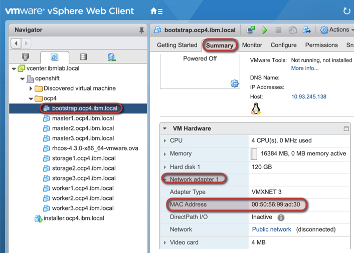
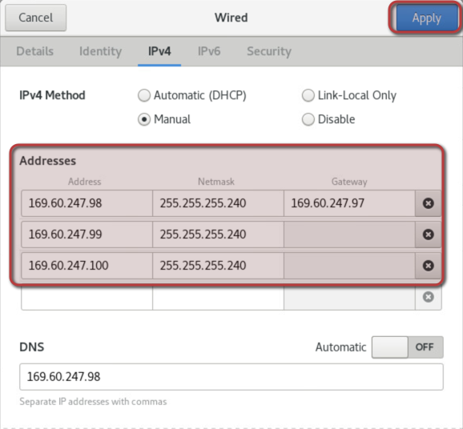

# Openshift Container Platform V4.3 Installation on Vsphere
## Table of Content
- [Cluster Information](#Cluster-Information)
- [Retrieve Red Hat registered account for your clients with Cloud Paks entitlement](#Retrieve-Red-Hat-registered-account-for-your-clients-with-Cloud-Paks-entitlement)
- [Prepare the necessary infrastructure](#Prepare-the-necessary-infrastructure)
- [Prepare the installer virtual machine](#Prepare-the-installer-virtual-machine)
- [Prepare cluster ignition files](#Prepare-cluster-ignition-files)
- [Create the cluster VMs](#Create-the-cluster-VMs)
- [Install and configure dnsmasq](#Install-and-configure-dnsmasq)
- [Prepare loadbalancing server](#Prepare-loadbalancing-server)
- [Start bootstrap process](#Start-bootstrap-process)
- [Post installation configuration](#Post-installation-configuration)
- [Configure cluster authentication](#Configure-cluster-authentication)
- [Complete and verify cluster installation](#Complete-and-verify-cluster-installation)
- [Configuring Rook Ceph storage](#Configuring-Rook-Ceph-storage)
- [Install Local image registry](#Install-Local-image-registry)
- [References](#References)

## Cluster Information:
* Control-plane vip: 10.171.57.99
* Compute/apps local vip: 10.171.57.100
* Compute/apps public vip: 169.60.247.102
* Installer VM: 10.171.57.98 - 169.60.247.101
* Bootstrap VM: 10.171.57.100
* Master nodes: 10.171.57.101/102/103
* Worker nodes: 10.171.57.104/105/106/107/108/109
## Prepare the necessary infrastructure:
1. Build a VMware Vsphere environment using your prefered way. We used in this guide 2 bare-metal ESXi servers and one Vcenter virtual server provisioned on IBM Cloud backed with iSCSI block storage. 
2. Provision a new RHEL 8 virtual machine on vcenter with hostname "installer.cp.ibm.local" and assign it 2cores/16GB-Memory/50GB-disk. This machine will be used as a client to control the openshift installation, it will also host the following components:
* DNS/DHCP server (dnsmasq)
* Load-balancer (haproxy)
* Firewalld NATing in order to provide internet connectivity to the cluster without assigning public IP to each node. [explained here](./configure-nat.md)
## Retrieve Red Hat registered account for your clients with Cloud Paks entitlement
* The process is explained [here](./retrieve-ocp-subscription.md).
## Prepare the installer virtual machine:
1. login into "installer.cp.ibm.local" with root privileges.
2. Set the installer server hostname:
```shell
hostnamectl set-hostname installer.cp.ibm.local
```
3. Disable selinux
```shell
sed -i 's/SELINUX=enforcing/SELINUX=disabled/' /etc/selinux/config
systemctl reboot
```
4. Configure Redhat subscription of the added server:
```shell
subscription-manager register --username='alaa-farrag-ibm' --password='xxxx'
```
5. Enable "Red Hat Developer Subscription":
```shell
subscription-manager list --available
subscription-manager attach --pool=8a85f99c6defdbe7016e022c8ecf7dde
```
6. Install httpd server:
```shell
yum install -y httpd
```
7. create a new directory to host the cluster installation artifacts:
```shell
mkdir -p /workspace/cp
```
8. Expose the created folder through httpd server:
```shell
ln -s /workspace/cp /var/www/html/ocp-www
```
9. Update the httpd server to only listen on the installer local IP address (not the LA IP address) by applying the following configuration:
```
use the "Listen" config to assign specific IP address in "/etc/httpd/conf/httpd.conf" config file
Listen 10.171.57.98:80

use the "Listen" config to assign specific IP address in "/etc/httpd/conf.d/ssl.conf" config file
Listen 10.171.57.98:443 https
10. Since the installer VM is using its public interface as the default gateway, a static route needs to be added to route private IP range of IBM cloud to the private interface:
```
nmcli connection modify ens224 +ipv4.routes "10.0.0.0/8 10.171.57.97"
nmcli connection down ens224
nmcli connection up ens224
``` 
10. Start and enable httpd service:
```shell
systemctl enable --now httpd
```
11. Add firewalld rules to allow HTTP communication:
```
{
firewall-cmd --zone=internal --add-port=80/tcp --permanent
firewall-cmd --reload
}
```
11. Apply firewalld rules to allow the necessary flows:
```
{
firewall-cmd --zone=internal --add-port=53/udp --permanent
firewall-cmd --zone=internal --add-port=53/tcp --permanent
firewall-cmd --zone=internal --add-service=dhcp --permanent
firewall-cmd --zone=internal --add-service=dhcpv6 --permanent
firewall-cmd --zone=internal --add-service=dhcpv6-client --permanent
firewall-cmd --zone=internal --add-port=6443/tcp --permanent
firewall-cmd --zone=internal --add-port=22623/tcp --permanent
firewall-cmd --zone=internal --add-port=443/tcp --permanent
firewall-cmd --zone=external --add-port=443/tcp --permanent
firewall-cmd --zone=internal --add-port=80/tcp --permanent
firewall-cmd --zone=external --add-port=80/tcp --permanent
firewall-cmd --reload
}
```
11. download openshift client and installer for linux (can be downloaded from https://cloud.redhat.com/openshift/):
```shell
wget https://mirror.openshift.com/pub/openshift-v4/clients/ocp/4.3.12/openshift-install-linux-4.3.12.tar.gz
wget https://mirror.openshift.com/pub/openshift-v4/clients/ocp/4.3.12/openshift-client-linux-4.3.12.tar.gz
```
12. Install the downloaded clients:
```shell
{
tar xvfz openshift-install-linux-4.3.12.tar.gz
tar xvfz openshift-client-linux-4.3.12.tar.gz
mv kubectl oc openshift-install /usr/local/bin/
}
```
13. Configure "oc" bash auto-completion:
```shell
# execute the following then reopen your shell
yum -y install bash-completion
oc completion bash >>/etc/bash_completion.d/oc_completion
kubectl completion bash >>/etc/bash_completion.d/kubectl_completion
```
14. Generate a new ssh key file:
```shell
ssh-keygen -t rsa -b 4096 -N '' -f /workspace/cp/sshkey
```
15. Start ssh-agent and load keyfile:
```shell
eval "$(ssh-agent -s )"
ssh-add /workspace/cp/sshkey
```
## Prepare cluster ignition files:
1. From [Redhat Openshift cluster manager website](https://cloud.redhat.com/openshift/install/vsphere/user-provisioned), retrieve a pull secret needed to pull the necessary OCP images. Save the secret in "/workspace/ocp42/pull-secret.json"
2. Create an installation configuration file called "/workspace/cp/install-config.yaml" as per the following. Include the content of Redhat pull secret file "pull-secret.json" and the generated ssh public key "sshkey.pub".
```yaml
cat << EOF > /workspace/cp/install-config.yaml
apiVersion: v1
baseDomain: ibm.local
compute:
- hyperthreading: Enabled   
  name: worker
  replicas: 0
controlPlane:
  hyperthreading: Enabled   
  name: master
  replicas: 3
metadata:
  name: cp
platform:
  none: {}
pullSecret: '{"auths":{"cloud.openshift.com":{"auth":"b3BlbnNoaWZ0LXJlbGVhc2UtZGV2K2FsYWFmYXJyYWcxdmpxMHNpMWkydGN0NzQ2bHJheGhtYjd1Znk6UElFMEszWFE0NEJXRUNCNDVJM0pJSE5SWlo3VlROSTVJQUYyR1BIWVdTNzI1V1ZMTVA4VjRJQ0hEUDdGMjVVTA==","email":"alaa.farrag@sa.ibm.com"},"quay.io":{"auth":"b3BlbnNoaWZ0LXJlbGVhc2UtZGV2K2FsYWFmYXJyYWcxdmpxMHNpMWkydGN0NzQ2bHJheGhtYjd1Znk6UElFMEszWFE0NEJXRUNCNDVJM0pJSE5SWlo3VlROSTVJQUYyR1BIWVdTNzI1V1ZMTVA4VjRJQ0hEUDdGMjVVTA==","email":"alaa.farrag@sa.ibm.com"},"registry.connect.redhat.com":{"auth":"NTI1MjQ1MTV8dWhjLTFWalEwU0kxaTJ0Y3Q3NDZsUmF4SG1CN3VmeTpleUpoYkdjaU9pSlNVelV4TWlKOS5leUp6ZFdJaU9pSXlNR0V6Tmpaak5qWmxNMk0wWkdZMllXVXlOVGM0WlRNNVlXWXdZV1l6WlNKOS52Mm02eklFZ05XWkFEU24yZmdWUmEyOW51N2FPX0J6QTFmODR2UWVBa185SVNhY19uaHp5TzlNQXpWN2k3MXQwOEM5a1VPamx0SmtJeGI3Q2ZXR0ZoSEdHV3VzVzNVV21Fc0ZpS3I5RFpEUVFQNmY0VV9GamxHMlZ1TjlnM2dzMXlJVDVlR1BSRkpoNGNjcG82Y01JVXMteDFEdTlSTHhaRlNWVDZLcUdrbFVlQzVNVERULVpxSHZabUhDTEZTVUo3Y21udDZEZWY5RDM2NU9rWEtjN0JyYk5VNXVfWmR4VjlvYTlfRXVBQnkxZkhBOEtuMHJOWmtwQXB1X0l0aVREanNwSHctc3MwYVlRX1ZkMmdIZXZYbEhrUmVaSjdjaGw4ZW43MWt2ODY2TVJCV0kwcHYyY3FIZjR6U203bVZVbUNYaUIyREUzSDVxZ3lsM1hVaXZ4WFhZczluUlgyZ21YRlExSkVxMG5DMnZuTEgydFJrbWZac09ZT3BsM28yOHB3MGpBSHdiRlZfdE5yalBfQXN0UUJOZWRZUU03OVBBaEpXQ05zLW0wMlk5ZFlpVEl3SlIyZ0ZyUUVIM2R2NTVhaUtTX09LYldsc3R1dGdJbVlsMk11NGdYZ3pyMzYwbkxIUUEzeWxBbngtbzgtaXE0QU5ndUFXa29BZzZ6T1YxbVZZRkFuLUFXSC1ZQkRqN1VEd2dqQW5LLWJ6QXdXZjFEb0I2R0l2M0NNdVhrWjl5a2lIYXFKU1B3SkxjU0R5eGNlWWlWQUlaWDV2NUpzQUE5dXdRcDhBMFpfZklfblRHa3YxTnhNdmc2bWpqY19ZcGJnWFZocnJISzllWnQwSXpvMWNseE1OYVdZUjF3Y1dqNXZ4MFRBb1gxUG1tQ2ZrSlhoSWJMZk9Edm10NA==","email":"alaa.farrag@sa.ibm.com"},"registry.redhat.io":{"auth":"NTI1MjQ1MTV8dWhjLTFWalEwU0kxaTJ0Y3Q3NDZsUmF4SG1CN3VmeTpleUpoYkdjaU9pSlNVelV4TWlKOS5leUp6ZFdJaU9pSXlNR0V6Tmpaak5qWmxNMk0wWkdZMllXVXlOVGM0WlRNNVlXWXdZV1l6WlNKOS52Mm02eklFZ05XWkFEU24yZmdWUmEyOW51N2FPX0J6QTFmODR2UWVBa185SVNhY19uaHp5TzlNQXpWN2k3MXQwOEM5a1VPamx0SmtJeGI3Q2ZXR0ZoSEdHV3VzVzNVV21Fc0ZpS3I5RFpEUVFQNmY0VV9GamxHMlZ1TjlnM2dzMXlJVDVlR1BSRkpoNGNjcG82Y01JVXMteDFEdTlSTHhaRlNWVDZLcUdrbFVlQzVNVERULVpxSHZabUhDTEZTVUo3Y21udDZEZWY5RDM2NU9rWEtjN0JyYk5VNXVfWmR4VjlvYTlfRXVBQnkxZkhBOEtuMHJOWmtwQXB1X0l0aVREanNwSHctc3MwYVlRX1ZkMmdIZXZYbEhrUmVaSjdjaGw4ZW43MWt2ODY2TVJCV0kwcHYyY3FIZjR6U203bVZVbUNYaUIyREUzSDVxZ3lsM1hVaXZ4WFhZczluUlgyZ21YRlExSkVxMG5DMnZuTEgydFJrbWZac09ZT3BsM28yOHB3MGpBSHdiRlZfdE5yalBfQXN0UUJOZWRZUU03OVBBaEpXQ05zLW0wMlk5ZFlpVEl3SlIyZ0ZyUUVIM2R2NTVhaUtTX09LYldsc3R1dGdJbVlsMk11NGdYZ3pyMzYwbkxIUUEzeWxBbngtbzgtaXE0QU5ndUFXa29BZzZ6T1YxbVZZRkFuLUFXSC1ZQkRqN1VEd2dqQW5LLWJ6QXdXZjFEb0I2R0l2M0NNdVhrWjl5a2lIYXFKU1B3SkxjU0R5eGNlWWlWQUlaWDV2NUpzQUE5dXdRcDhBMFpfZklfblRHa3YxTnhNdmc2bWpqY19ZcGJnWFZocnJISzllWnQwSXpvMWNseE1OYVdZUjF3Y1dqNXZ4MFRBb1gxUG1tQ2ZrSlhoSWJMZk9Edm10NA==","email":"alaa.farrag@sa.ibm.com"}}}'
sshKey: 'ssh-rsa AAAAB3NzaC1yc2EAAAADAQABAAACAQC0jMXcdqAzDYKkD1VrEa2fdw4/6wvFjQqqlVlmDYOgdFByEXTWWkG8kJjsrZR4D671kktdj9FwVE1rBvmjVo/L8LZ/3ikZdxJXjrLosB4/6vUr0UAvfBHW0sGQIZaKBIqybOX5ALO8GHWhsvnTr7TsFP5w8Vq1evl8Crio+i3ydpiTfNWwkPAebtZIt0i5LgJRIc3t1D/wRZnDZ8U/DAbkYc6YosYLVoc7GoGcKdGXhLBgztFxLlPk3CZqxHea7gZgmbwJY7UK+N4THj+m/oynQ+YWRRU7WxPuVjSmApVxLVssLLRzKhpsuSz4AgYETMpiBfJYW5N5DrgyV4Tx+jWwIarjnV/R8g9wyi83NmLp6aO3K2MC/AfjNGTXXkuCzny1uKbanvy+WqCG7ohRSMJm2zkD2/2BMQqKD/sCEsckqgur6CpEN8Rbf8r5DrJSDcveiaZ8kVg2f1a/xSCeZkFldhAR9oWxNMOahrka5YXrq65AumQ1X16xIL6YV+SBD0Q7LMY+bDn8Z2Wa8xY3InMRP0Qycdz8FVteMNKwQ05LNjqiN9J4Ij0fGxkfmDl9pRZwTKMGWS9Yn0TKYcLSnzjI3dm1Q5nep6zlPEhP962z49ziBGAwU0lR/PDQGDtOqRbk+PaQygsA/IQioQcLD8UAWliSppAx9M7WnOE8D3mv8Q== root@installer.cp.ibm.local'
EOF
```
3. take a backup of the "/workspace/cp/install-config.yaml" as it will be deleted after generating the cluster manifest files:
```shell
cp /workspace/cp/install-config.yaml /workspace/cp/install-config.yaml.bkp
```
4. create the cluster installation manifest files, these files will be saved in "/workspace/cp/manifests":
```shell
openshift-install create manifests --dir /workspace/cp
```
5. if you want to pervent master nodes from hosting workload pods, change the "spec.mastersSchedulable" property to false in "cluster-scheduler-02-config.yml" manifest file.
6. Create ignition files:
```shell
openshift-install create ignition-configs --dir /workspace/cp
```
7. Set read only access for bootstrap ignition file:
```shell
chmod 544 /workspace/cp/bootstrap.ign
```
8. Create "/workspace/cp/append-bootstrap.ign" file with the following content:
```shell
cat << EOF > /workspace/cp/append-bootstrap.ign
{
  "ignition": {
    "config": {
      "append": [
        {
          "source": "http://10.171.57.98/ocp-www/bootstrap.ign", 
          "verification": {}
        }
      ]
    },
    "timeouts": {},
    "version": "2.1.0"
  },
  "networkd": {},
  "passwd": {},
  "storage": {},
  "systemd": {}
}
EOF
```
9. Convert the master, worker, and secondary bootstrap Ignition config files to Base64 encoding:
```shell
{
base64 -w0 /workspace/cp/master.ign > /workspace/cp/master.64
base64 -w0 /workspace/cp/worker.ign > /workspace/cp/worker.64
base64 -w0 /workspace/cp/append-bootstrap.ign > /workspace/cp/append-bootstrap.64
}
```
## Create the cluster VMs
Note: Below screen captures are provided for guidence if you are not familier with vCenter, they are not completely matching this environment:  
1. Download coreos OVA image from redhat download site "https://cloud.redhat.com/openshift/install/vsphere/user-provisioned" and save it:
```shell
cd /workspace/cp
wget "https://mirror.openshift.com/pub/openshift-v4/dependencies/rhcos/latest/latest/rhcos-4.3.8-x86_64-vmware.x86_64.ova" -O rhcos-4.3.8-x86_64-vmware.x86_64.ova
```
2. From vmware vCenter UI "vcenter.ibmlab.local", Create a new folder as shown below. give it a name that matches the cluster name that you specified in the install-config.yaml file which is "cp". Folder name should match the cluster name defined by "metadata.name" property in "install-config.yaml" config file. It will also be part of the cluster FQDN (".<metadata.name>.<baseDomain>"):
<kbd></kbd>
<kbd></kbd>
3. Create a VM template from RHCOS OVA image as per the following:
<kbd></kbd>
<kbd></kbd>
<kbd></kbd>
<kbd></kbd>
<kbd></kbd>
<kbd></kbd>
<kbd></kbd>
<kbd></kbd>
<kbd></kbd>

4. Create a new VM from the created template to host the bootstrap node:
<kbd></kbd>
<kbd></kbd>
<kbd></kbd>
<kbd></kbd>
<kbd></kbd>
<kbd></kbd>
<kbd></kbd>
<kbd></kbd>
  
Add the following properties:
* Name: "guestinfo.ignition.config.data"  
  Value: content of file "/workspace/ocp42/append-bootstrap.64"  
* Name: "guestinfo.ignition.config.data.encoding"  
  Value: "base64"
* Name: "disk.EnableUUID"  
  Value: "TRUE"  

<kbd></kbd>
<kbd></kbd>  
5. Repeat the same process to create other cluster nodes (master & compute), just make sure you are using the correct amount of CPU/RAM/Disk for each type of nodes and also update the properties with the ignition file suitable for the node type you are creating as per the following:
  #### Master nodes:
  * Name: "guestinfo.ignition.config.data"  
  Value: content of file "/workspace/ocp42/master.64" 
  #### Compute nodes:
  * Name: "guestinfo.ignition.config.data"  
  Value: content of file "/workspace/ocp42/worker.64"
  #### Minimum resources requirements:
  <kbd></kbd> 
6. For the storage nodes, they will use the same configuration as worker nodes however you might need to add extra disks to be used for the persistent storage provider that will be used:
<kbd></kbd>

## Install and configure dnsmasq:
1. Install dnsmasq on the installer VM:
```shell
yum install -y dnsmasq
```
2. Retrieve the MAC addressess of the created VM from the vCenter then update the DNS/DHCP configuration ensure the IP assignment for all the created virtual machines.
<kbd></kbd>
3. Apply dnsmasq configuration as per the following:

* Control-plane vip: 10.171.57.99
* Compute/apps local vip: 10.171.57.100
* Compute/apps public vip: 169.60.247.102
* Installer VM: 10.171.57.98 - 169.60.247.101
* Bootstrap VM: 10.171.57.110
* Master nodes: 10.171.57.101/102/103
* Worker nodes: 10.171.57.104/105/106/107/108/109

```shell
cat << EOF > /etc/dnsmasq.d/ocp.conf
# Common Config
bind-interfaces
interface=lo,ens224
dhcp-option=option:router,10.171.57.97
dhcp-option=option:dns-server,10.171.57.98
dhcp-range=10.171.57.113,10.171.57.114
resolv-file=/etc/resolv.dnsmasq.conf

#vcenter endpoint
address=/vcenter.ibmlab.local/169.48.130.28

# Cluster end-points:
# Master api server DNS record
address=/api-int.cp.ibm.local/10.171.57.99
address=/api.cp.ibm.local/10.171.57.99

# Router wildcard DNS record
address=/.apps.cp.ibm.local/169.60.247.102
address=/.apps-local.cp.ibm.local/10.171.57.100

# ETCD DNS records
address=/etcd-0.cp.ibm.local/10.171.57.101
srv-host=_etcd-server-ssl._tcp.cp.ibm.local,etcd-0.cp.ibm.local,2380
address=/etcd-1.cp.ibm.local/10.171.57.102
srv-host=_etcd-server-ssl._tcp.cp.ibm.local,etcd-1.cp.ibm.local,2380
address=/etcd-2.cp.ibm.local/10.171.57.103
srv-host=_etcd-server-ssl._tcp.cp.ibm.local,etcd-2.cp.ibm.local,2380


# Node specific config
# Bootstrap
dhcp-host=00:50:56:99:73:1b,10.171.57.110
address=/bootstrap.cp.ibm.local/10.171.57.110
ptr-record=110.57.171.10.in-addr.arpa,bootstrap.cp.ibm.local

# master1
dhcp-host=00:50:56:99:eb:0d,10.171.57.101
address=/master1.cp.ibm.local/10.171.57.101
ptr-record=101.57.171.10.in-addr.arpa,master1.cp.ibm.local

# master2
dhcp-host=00:50:56:99:fe:30,10.171.57.102
address=/master2.cp.ibm.local/10.171.57.102
ptr-record=102.57.171.10.in-addr.arpa,master2.cp.ibm.local

# master3
dhcp-host=00:50:56:99:06:25,10.171.57.103
address=/master3.cp.ibm.local/10.171.57.103
ptr-record=103.57.171.10.in-addr.arpa,master3.cp.ibm.local

# worker1
dhcp-host=00:50:56:99:c3:00,10.171.57.104
address=/worker1.cp.ibm.local/10.171.57.104
ptr-record=104.57.171.10.in-addr.arpa,worker1.cp.ibm.local

# worker2
dhcp-host=00:50:56:99:48:6c,10.171.57.105
address=/worker2.cp.ibm.local/10.171.57.105
ptr-record=105.57.171.10.in-addr.arpa,worker2.cp.ibm.local

# worker3
dhcp-host=00:50:56:99:14:28,10.171.57.106
address=/worker3.cp.ibm.local/10.171.57.106
ptr-record=106.57.171.10.in-addr.arpa,worker3.cp.ibm.local

# worker4
dhcp-host=00:50:56:99:11:44,10.171.57.107
address=/worker4.cp.ibm.local/10.171.57.107
ptr-record=107.57.171.10.in-addr.arpa,worker4.cp.ibm.local

# worker5
dhcp-host=00:50:56:99:08:e5,10.171.57.108
address=/worker5.cp.ibm.local/10.171.57.108
ptr-record=108.57.171.10.in-addr.arpa,worker5.cp.ibm.local

# worker6
dhcp-host=00:50:56:99:36:b3,10.171.57.109
address=/worker6.cp.ibm.local/10.171.57.109
ptr-record=109.57.171.10.in-addr.arpa,worker6.cp.ibm.local
EOF
```
4. Configure your dnsmasq to upsteam to your environment external DNS server
```shell
cat << EOF > /etc/resolv.dnsmasq.conf
nameserver 8.8.8.8
EOF
```
5. update the installer server to resolve from its dns server:
```shell
mv /etc/resolv.conf  /etc/resolv.conf.orig
nmcli con mod ens192 ipv4.dns "10.171.57.98"
systemctl restart NetworkManager.service
```
6. Start and enable DNS Masq server
```shell
systemctl enable --now dnsmasq.service
```

## Prepare loadbalancing server
1. add the control plane LB IP "10.171.57.99" and apps local LB IP "10.171.57.100" as secondry IPs for the installer vm private network interface "ens224". Also add apps public LB IP "169.60.247.102" as secondry IPs for the installer vm public network interface "ens192". Example of adding secondary IPs:
<kbd></kbd>

2. install haproxy loadbalancer on the installer vm:
```shell
yum install -y haproxy
```
3. Configure haproxy to loadbalance both the control and compute traffic by adding the followng lines to haproxy configuration file "/etc/haproxy/haproxy.cfg":
```shell
cat << EOF > /etc/haproxy/haproxy.cfg
#---------------------------------------------------------------------
# Example configuration for a possible web application.  See the
# full configuration options online.
#
#   https://www.haproxy.org/download/1.8/doc/configuration.txt
#
#---------------------------------------------------------------------

#---------------------------------------------------------------------
# Global settings
#---------------------------------------------------------------------
global
    # to have these messages end up in /var/log/haproxy.log you will
    # need to:
    #
    # 1) configure syslog to accept network log events.  This is done
    #    by adding the '-r' option to the SYSLOGD_OPTIONS in
    #    /etc/sysconfig/syslog
    #
    # 2) configure local2 events to go to the /var/log/haproxy.log
    #   file. A line like the following can be added to
    #   /etc/sysconfig/syslog
    #
    #    local2.*                       /var/log/haproxy.log
    #
    log         127.0.0.1 local2

    chroot      /var/lib/haproxy
    pidfile     /var/run/haproxy.pid
    maxconn     4000
    user        haproxy
    group       haproxy
    daemon

    # turn on stats unix socket
    stats socket /var/lib/haproxy/stats

    # utilize system-wide crypto-policies
    ssl-default-bind-ciphers PROFILE=SYSTEM
    ssl-default-server-ciphers PROFILE=SYSTEM

#---------------------------------------------------------------------
# common defaults that all the 'listen' and 'backend' sections will
# use if not designated in their block
#---------------------------------------------------------------------
defaults
    mode                    http
    log                     global
    option                  httplog
    option                  dontlognull
    option http-server-close
    option forwardfor       except 127.0.0.0/8
    option                  redispatch
    retries                 3
    timeout http-request    10s
    timeout queue           1m
    timeout connect         10s
    timeout client          1m
    timeout server          1m
    timeout http-keep-alive 10s
    timeout check           10s
    maxconn                 3000

# Control Plane config
frontend api
    bind 10.171.57.99:6443
    mode tcp
    default_backend             api

frontend machine-config
    bind 10.171.57.99:22623
    mode tcp
    default_backend             machine-config

backend api
    mode tcp
    balance     roundrobin
    server  bootstrap 10.171.57.110:6443 check
    server  master01 10.171.57.101:6443 check
    server  master02 10.171.57.102:6443 check
    server  master03 10.171.57.103:6443 check

backend machine-config
    mode tcp
    balance     roundrobin
    server  bootstrap 10.171.57.110:22623 check
    server  master01 10.171.57.101:22623 check
    server  master02 10.171.57.102:22623 check
    server  master03 10.171.57.103:22623 check

# apps config
frontend https
    mode tcp
    bind 169.60.247.102:443
    default_backend             https

frontend http
    mode tcp
    bind 169.60.247.102:80
    default_backend             http

frontend https-local
    mode tcp
    bind 10.171.57.100:443
    default_backend             https

frontend http-local
    mode tcp
    bind 10.171.57.100:80
    default_backend             http

backend https
    mode tcp
    balance     roundrobin
    server  worker01 10.171.57.104:443 check
    server  worker02 10.171.57.105:443 check
    server  worker03 10.171.57.106:443 check
    server  worker04 10.171.57.107:443 check
    server  worker05 10.171.57.108:443 check
    server  worker06 10.171.57.109:443 check

backend http
    mode tcp
    balance     roundrobin
    server  worker01 10.171.57.104:80 check
    server  worker02 10.171.57.105:80 check
    server  worker03 10.171.57.106:80 check
    server  worker04 10.171.57.107:80 check
    server  worker05 10.171.57.108:80 check
    server  worker06 10.171.57.109:80 check
EOF
```
4. Start and enable haproxy
```
systemctl enable --now haproxy
```
## Start bootstrap process
1. From the vcenter UI, start all the created OCP VMs.
2. Check the content of dnsmasq lease file "/var/lib/dnsmasq/dnsmasq.leases" to ensure that the VMs has been assigned the correct IPs.
3. You can use the following command to check if the bootstap process is completed or still in progress.
```shell
openshift-install --dir /workspace/cp wait-for bootstrap-complete --log-level debug
DEBUG OpenShift Installer 4.3.12                   
DEBUG Built from commit db4411451af55e0bab7258d25bdabd91ea48382f 
INFO Waiting up to 30m0s for the Kubernetes API at https://api.cp.ibm.local:6443... 
INFO API v1.16.2 up                               
INFO Waiting up to 30m0s for bootstrapping to complete... 
DEBUG Bootstrap status: complete                   
INFO It is now safe to remove the bootstrap resources 
```
4. It took about 10mins to bootstrap the cluster, if it is taking more time, you can further investigate by ssh to the bootstrap node and get the logs of the bootkube service as per the following:
```shell
ssh -i /workspace/cp/sshkey core@10.171.57.101
journalctl -b -f -u bootkube.service
```
5. You can also gather the bootstrap process logs using the following command:
```shell
openshift-install --dir /workspace/cp gather bootstrap --bootstrap 10.171.57.101 --master 10.171.57.102
```
6. If you have a configuration issue and you want to regenerate the ignition files, it is important to delete and recreate the VMs using the new ignition configuration. If you are doing so, remember to update the dnsmasq DHCP configuration with the new VMs MAC addresses and clear the content of the lease file "/var/lib/dnsmasq/dnsmasq.leases" then restart the dnsmasq service. After this you can start the new VMs.
7. After the bootstrap process is complete, remove the bootstrap node from the control plane load balancing in the haproxy configuration then restart it.

## Configure cluster authentication
1. Login to the cluster using kubeconfig file:
```shell
export KUBECONFIG=/workspace/cp/auth/kubeconfig
```
2. From the installation VM, install htpasswd tool to generate an encrypted password file:
```shell
yum -y install httpd-tools
htpasswd -c -B -b htpasswd.txt ocpadmin Oliya.20
```
3. Create a k8s secrete with the htpasswd file content:
```shell
oc create secret generic htpass-secret --from-file=htpasswd=htpasswd.txt -n openshift-config
```
4. Create k8s identity provider custom resource pointing to the created htpasswd secret 
```shell
cat << EOF > htpasswd.yaml
apiVersion: config.openshift.io/v1
kind: OAuth
metadata:
  name: cluster
spec:
  identityProviders:
  - name: my_htpasswd_provider 
    mappingMethod: claim 
    type: HTPasswd
    htpasswd:
      fileData:
        name: htpass-secret
EOF
```
5. Assign the necessary roles to the created users:
```shell
oc apply -f htpasswd.yaml
oc adm policy add-cluster-role-to-user cluster-admin ocpadmin
```
6. Unset the kubeconfig env variable (other wise you will get certificate issue when trying to login "error: x509: certificate signed by unknown authority"):
```shell
unset KUBECONFIG
```
7. Login to your cluster:
```shell
oc login https://api.cp.ibm.local:6443 --insecure-skip-tls-verify=true -u ocpadmin
```
## Complete and verify cluster installation:
1- Login to your cluster:
```shell
oc login https://api.cp.ibm.local:6443 --insecure-skip-tls-verify=true -u ocpadmin
```
2- Ensure all the nodes are in ready state:
```shell
[CLI]# oc get nodes
NAME                   STATUS   ROLES    AGE   VERSION
master1.cp.ibm.local   Ready    master   23m   v1.16.2
master2.cp.ibm.local   Ready    master   23m   v1.16.2
master3.cp.ibm.local   Ready    master   23m   v1.16.2
worker1.cp.ibm.local   Ready    worker   23m   v1.16.2
worker2.cp.ibm.local   Ready    worker   23m   v1.16.2
worker3.cp.ibm.local   Ready    worker   23m   v1.16.2
worker4.cp.ibm.local   Ready    worker   23m   v1.16.2
worker5.cp.ibm.local   Ready    worker   23m   v1.16.2
worker6.cp.ibm.local   Ready    worker   23m   v1.16.2
```
3- Ensure all the cluster operaters are in ready state:
```shell
oc get clusteroperators
NAME                                       VERSION   AVAILABLE   PROGRESSING   DEGRADED   SINCE
authentication                             4.3.12    True        False         False      2m4s
cloud-credential                           4.3.12    True        False         False      22m
cluster-autoscaler                         4.3.12    True        False         False      15m
console                                    4.3.12    True        False         False      9m38s
dns                                        4.3.12    True        False         False      19m
image-registry                             4.3.12    True        False         False      16m
ingress                                    4.3.12    True        False         False      15m
insights                                   4.3.12    True        False         False      16m
kube-apiserver                             4.3.12    True        False         False      17m
kube-controller-manager                    4.3.12    True        False         False      16m
kube-scheduler                             4.3.12    True        False         False      18m
machine-api                                4.3.12    True        False         False      19m
machine-config                             4.3.12    True        False         False      18m
marketplace                                4.3.12    True        False         False      15m
monitoring                                 4.3.12    True        False         False      9m47s
network                                    4.3.12    True        False         False      18m
node-tuning                                4.3.12    True        False         False      12m
openshift-apiserver                        4.3.12    True        False         False      15m
openshift-controller-manager               4.3.12    True        False         False      16m
openshift-samples                          4.3.12    True        False         False      14m
operator-lifecycle-manager                 4.3.12    True        False         False      16m
operator-lifecycle-manager-catalog         4.3.12    True        False         False      16m
operator-lifecycle-manager-packageserver   4.3.12    True        False         False      15m
service-ca                                 4.3.12    True        False         False      20m
service-catalog-apiserver                  4.3.12    True        False         False      16m
service-catalog-controller-manager         4.3.12    True        False         False      16m
storage                                    4.3.12    True        False         False      16m
```
4- Complete the cluster installation:
```shell
[CLI]# openshift-install --dir /workspace/cp wait-for install-complete --log-level debug
DEBUG OpenShift Installer 4.3.12                   
DEBUG Built from commit db4411451af55e0bab7258d25bdabd91ea48382f 
DEBUG Fetching Install Config...                   
DEBUG Loading Install Config...                    
DEBUG   Loading SSH Key...                         
DEBUG   Loading Base Domain...                     
DEBUG     Loading Platform...                      
DEBUG   Loading Cluster Name...                    
DEBUG     Loading Base Domain...                   
DEBUG     Loading Platform...                      
DEBUG   Loading Pull Secret...                     
DEBUG   Loading Platform...                        
DEBUG Using Install Config loaded from state file  
DEBUG Reusing previously-fetched Install Config    
INFO Waiting up to 30m0s for the cluster at https://api.cp.ibm.local:6443 to initialize... 
DEBUG Cluster is initialized                       
INFO Waiting up to 10m0s for the openshift-console route to be created... 
DEBUG Route found in openshift-console namespace: console 
DEBUG Route found in openshift-console namespace: downloads 
DEBUG OpenShift console route is created           
INFO Install complete!                            
INFO To access the cluster as the system:admin user when using 'oc', run 'export KUBECONFIG=/workspace/cp/auth/kubeconfig' 
INFO Access the OpenShift web-console here: https://console-openshift-console.apps.cp.ibm.local 
INFO Login to the console with user: kubeadmin, password: QYLFe-XXNys-tYq8I-QJKrW 
```
## Remove kubeadmin user after configuring external authentication:
Please make sure that you have configured an external authentication user (eg htpasswd) and you have assigned it a cluster-admin role.
```
oc delete secrets kubeadmin -n kube-system
``` 
## Configuring Rook Ceph storage:
Follow rook/ceph installation instructions available [here](./rook-ceph-install.md).
## Install Local image registry:
1. Create a RWX pvc using Cephfs (rook-cephfs) storage class:
```shell
cat << EOF > image-registry-storage.yaml 
apiVersion: v1
kind: PersistentVolumeClaim
metadata:
  name: image-registry-storage
  namespace: openshift-image-registry
spec:
  accessModes:
  - ReadWriteMany
  resources:
    requests:
      storage: 100Gi
  storageClassName: rook-cephfs
EOF
oc create -f image-registry-storage.yaml
```
2. Update the image registry operator configuration to use the created PVC:
```shell
oc edit configs.imageregistry.operator.openshift.io
```
```yaml
  storage:
    pvc:
      claim: image-registry-storage
```
3. Edit the operator configuration and change managementState from "Removed" to "Managed":
```
oc edit configs.imageregistry.operator.openshift.io
```
4. The registry containers should be created as per the following:
```
oc get po
NAME                                               READY   STATUS    RESTARTS   AGE
cluster-image-registry-operator-7857d56744-k5rrd   2/2     Running   0          52m
image-registry-57b8cbc9f8-787d8                    1/1     Running   0          41s
node-ca-5dc8g                                      1/1     Running   0          42s
node-ca-bk2bs                                      1/1     Running   0          42s
node-ca-fhjkw                                      1/1     Running   0          42s
node-ca-jtxp7                                      1/1     Running   0          42s
node-ca-ltgps                                      1/1     Running   0          42s
node-ca-qgstp                                      1/1     Running   0          42s
node-ca-svknq                                      1/1     Running   0          42s
node-ca-tdpj2                                      1/1     Running   0          42s
node-ca-v8fwd                                      1/1     Running   0          42s
```
5. Enable the default route for imager registry as per the following:
```
oc patch configs.imageregistry.operator.openshift.io/cluster --type merge -p '{"spec":{"defaultRoute":true}}'
```

## References:
* [Install OpenShift 4.2 on KVM by Zhimin Wen](https://itnext.io/install-openshift-4-2-on-kvm-1117162333d0)
* [Install_OCP_4.x by Victor Havard](https://github.com/ibm-cloud-architecture/refarch-privatecloud/blob/master/Install_OCP_4.x.md)
* [Red Hat Download](https://access.redhat.com/downloads)
* [OCP Port requirements](https://docs.openshift.com/container-platform/4.2/installing/installing_bare_metal/installing-bare-metal.html#installation-network-user-infra_installing-bare-metal)
