# Openshift VMs creation screen captures
## Create the cluster VMs
1. Download coreos OVA image from redhat download site "https://cloud.redhat.com/openshift/install/vsphere/user-provisioned" and save it:
```shell
cd /workspace/cp
wget "https://mirror.openshift.com/pub/openshift-v4/dependencies/rhcos/latest/latest/rhcos-4.3.8-x86_64-vmware.x86_64.ova" -O rhcos-4.3.8-x86_64-vmware.x86_64.ova
```
2. From vmware vCenter UI "vcenter.ibmlab.local", Create a new folder as shown below. give it a name that matches the cluster name that you specified in the install-config.yaml file which is "ocp4". Folder name should match the cluster name defined by "metadata.name" property in "install-config.yaml" config file. It will also be part of the cluster FQDN (".<metadata.name>.<baseDomain>") :  
<kbd>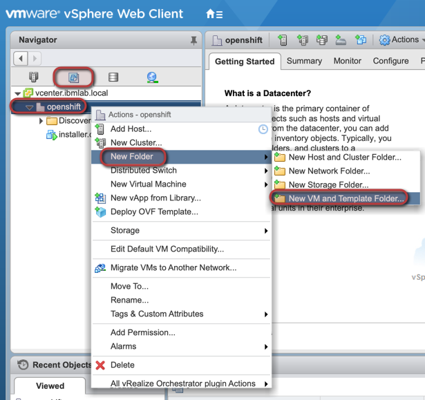</kbd>
<kbd>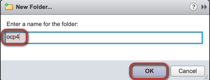</kbd>
3. Create a VM template from RHCOS OVA image as per the following:
<kbd>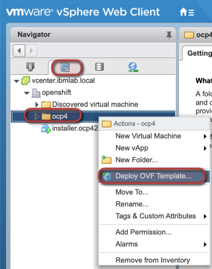</kbd>
<kbd>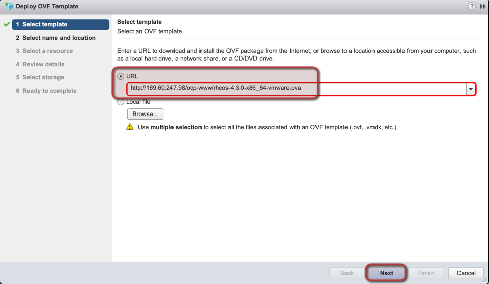</kbd>
<kbd>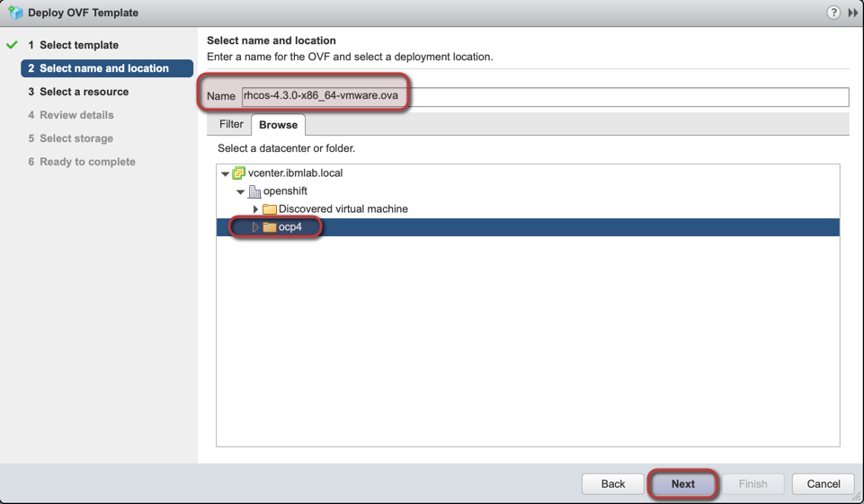</kbd>
<kbd></kbd>
<kbd>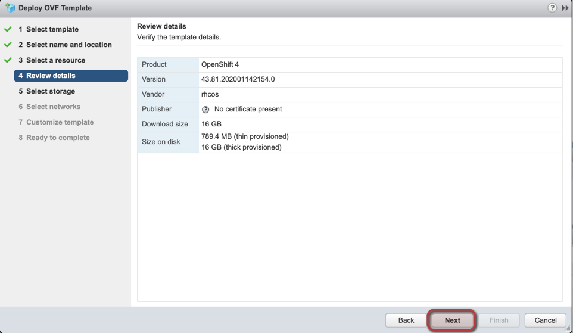</kbd>
<kbd>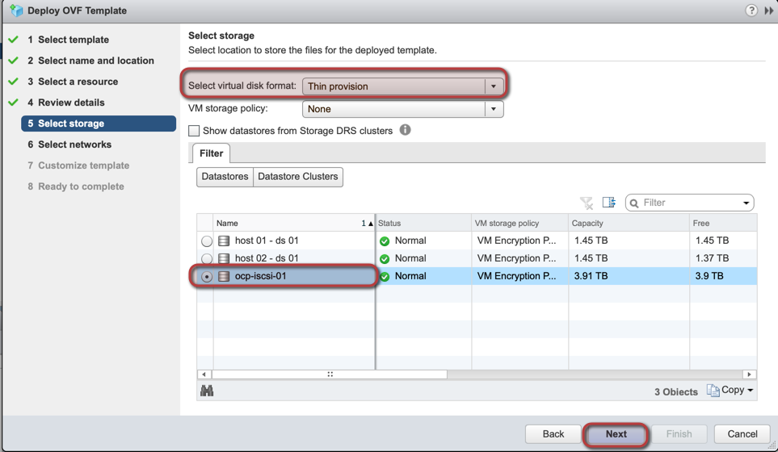</kbd>
<kbd>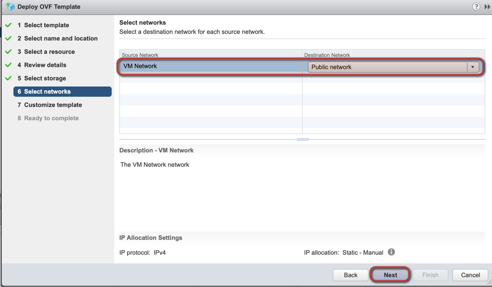</kbd>
<kbd>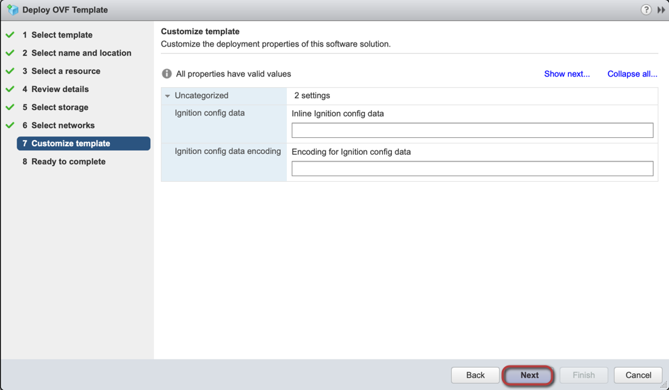</kbd>
<kbd>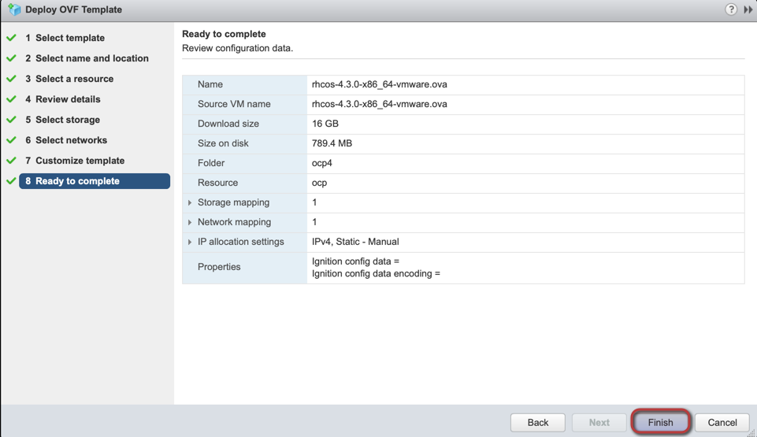</kbd>

4. Create a new VM from the created template to host the bootstrap node:
<kbd>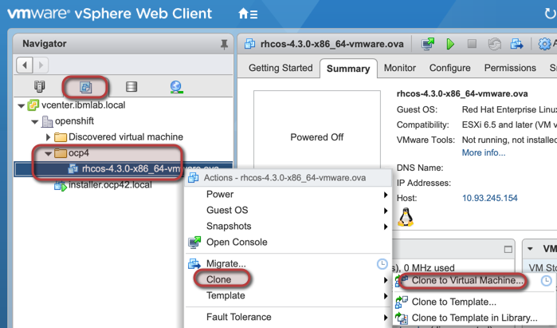</kbd>
<kbd>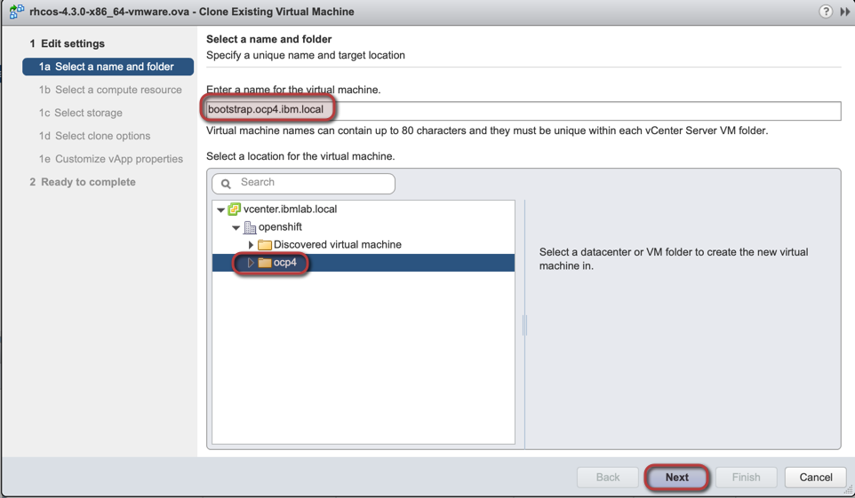</kbd>
<kbd>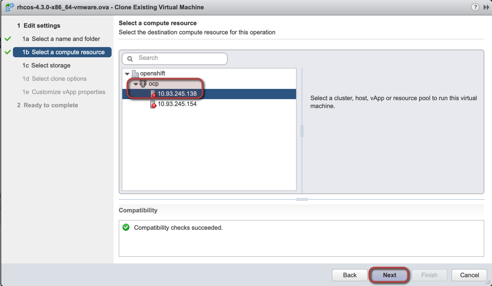</kbd>
<kbd>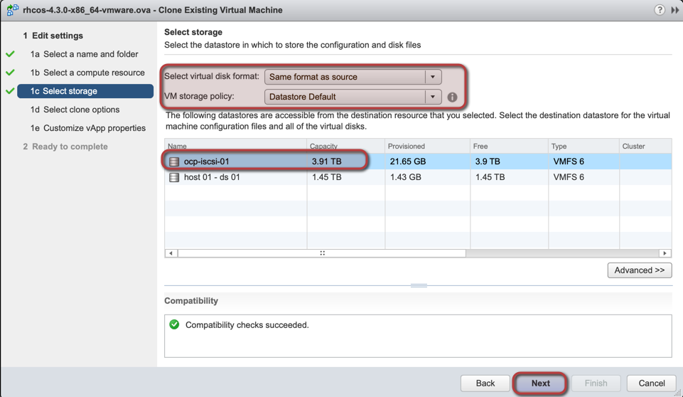</kbd>
<kbd>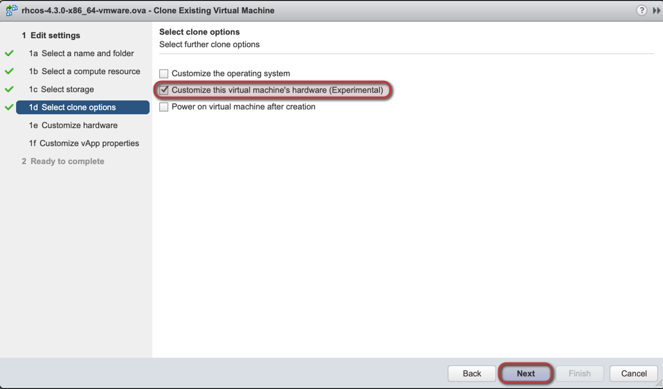</kbd>
<kbd>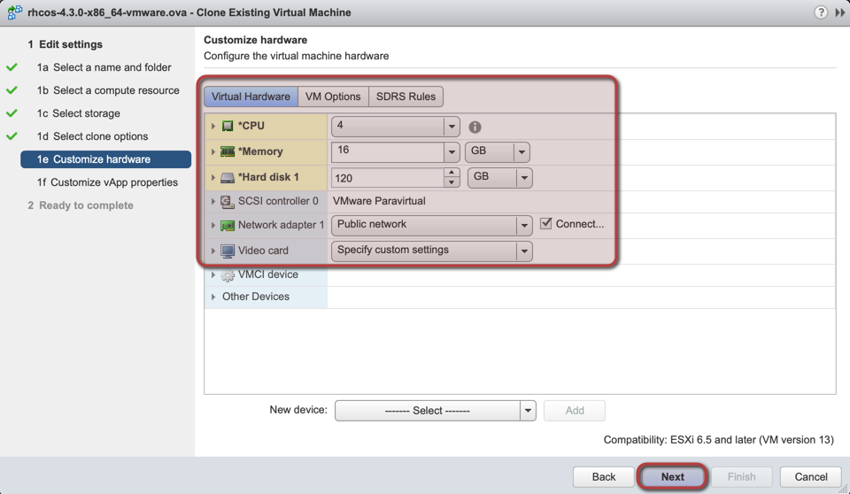</kbd>
<kbd>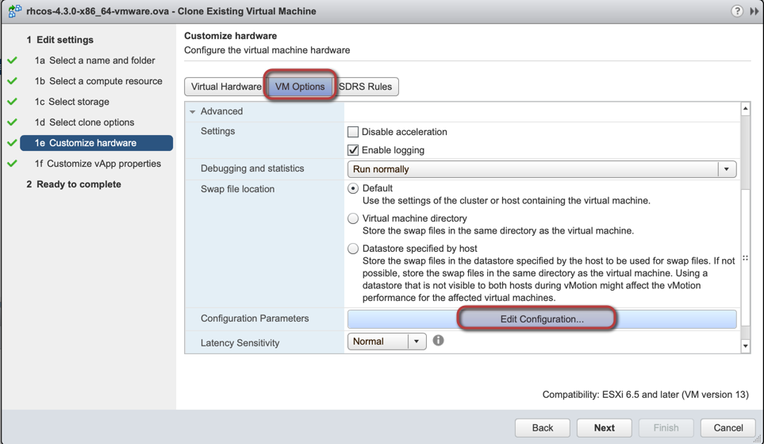</kbd>
<kbd>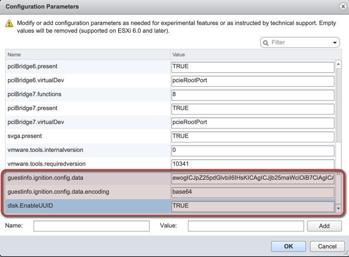</kbd>
  
Add the following properties:
* Name: "guestinfo.ignition.config.data"  
  Value: content of file "/workspace/ocp42/append-bootstrap.64"  
* Name: "guestinfo.ignition.config.data.encoding"  
  Value: "base64"
* Name: "disk.EnableUUID"  
  Value: "TRUE"  

<kbd>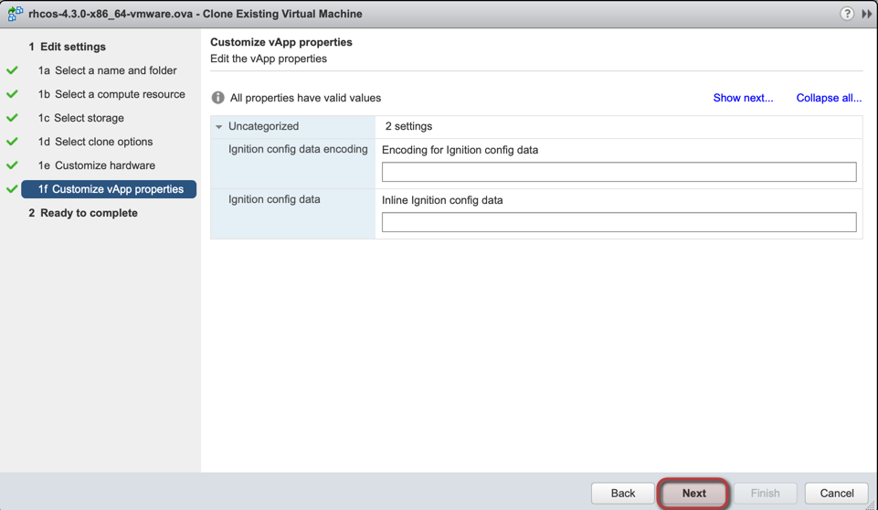</kbd>
<kbd>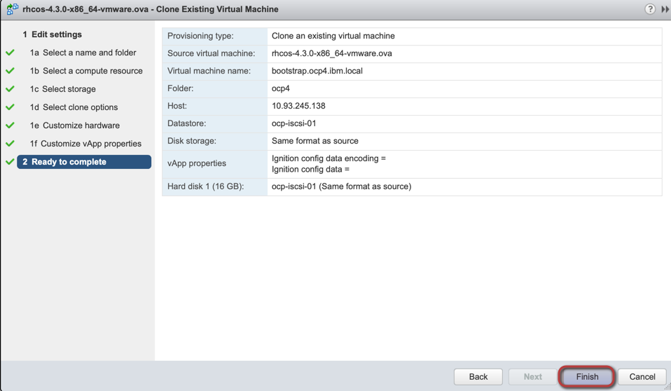</kbd>  
5. Repeat the same process to create other cluster nodes (master & compute), just make sure you are using the correct amount of CPU/RAM/Disk for each type of nodes and also update the properties with the ignition file suitable for the node type you are creating as per the following:
  #### Master nodes:
  * Name: "guestinfo.ignition.config.data"  
  Value: content of file "/workspace/ocp42/master.64" 
  #### Compute nodes:
  * Name: "guestinfo.ignition.config.data"  
  Value: content of file "/workspace/ocp42/worker.64"
  #### Minimum resources requirements:
  <kbd>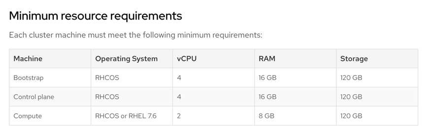</kbd> 
6. For the storage nodes, they will use the same configuration as worker nodes however you might need to add extra disks to be used for the persistent storage provider that will be used:
<kbd>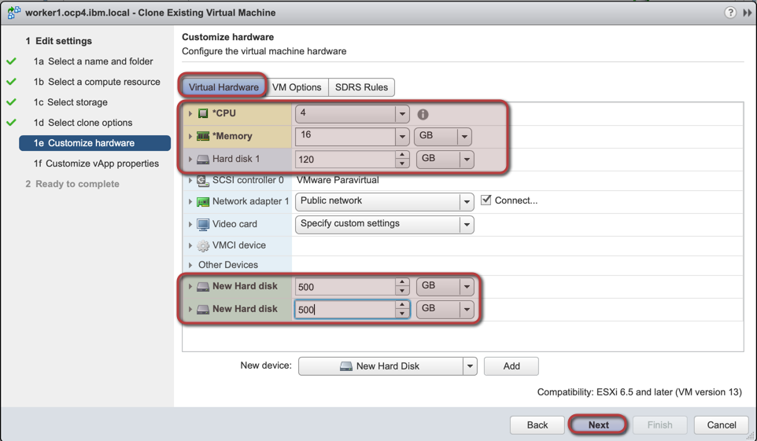</kbd>